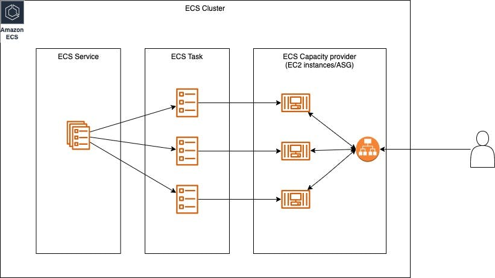

# How to Deploy an AWS ECS Cluster with Terraform

- There are mainly two ways of deploying a service on ECS clusters – Fargate and EC2 instances. 
    - Fargate: running containers are deployed automatically. Users do not provide compute capacity to ECS.
    - EC2: containers running as Tasks are deployed on user provider compute capacity.
- EC2 approach offers more control, Fargate is more convenient.
- ECS service consists of these components:

- Before a service is deployed, the ECS compute cluster must know where its "compute resources"/"compute capacity providers" are coming from. In this case, it is EC2.
- After the compute resources are registered with the ECS cluster, a service can be deployed on the cluster.

- Tasks:
    - Each task is defined in a Task Definition.
    - A Task Definition specifies the container image to be used, the CPU and memory resources required by a container running the image, host port mapping.

- Service:
    - A service can consist of multiple tasks.
    - The number of deployment replicas (i.e. Tasks) can be specified in the service definition.
    - During deployment of a task, the task is assigned a target EC2 instance where it will run in.

- Load Balancing:
    - The tasks within a service are running on EC2 instances operating behind an ALB (application load balancer) in a VPC.

- Why use ECS?
    - ECS is a managed environment optimized for running and orchestrating containers.
    - Integrates with Auto-Scaling, so the number of running tasks can auto-scale up/down based upon defined scaling policies and task placement (placement of the task on a compute resource).
    - ECS integrates with CloudWatch, providing built-in monitoring metrics and logs for the clusters.

- Template architecture of resources needed to provide ECS:
    - Notice the following:
        - One VPC
        - Two AZ and one subnet in each of them
        - A single security group is assigned to both subnets
        - EC2 instances to be deployed in each subnet. Collectively, they are the capacity provider to ECS
        - ECS Tasks to be deployed on the EC2 instances in each subnet. Amalgated together, they provide an ECS Service
        - The EC2 instances are part of an Auto-Scaling Group. And they sit behind an ALB.
        - The ECS cluster definition consists of the ECS service and ECS capacity provider